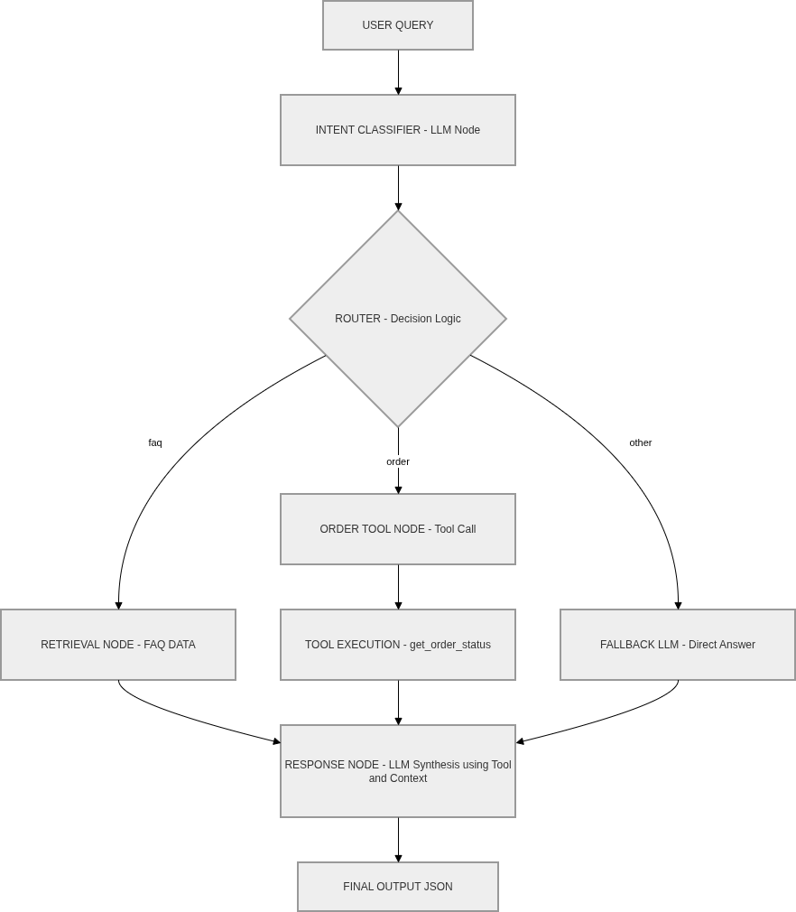

# LangGraph Customer Support Agent — Code Walkthrough

A simple AI customer support agent built using **LangGraph**. It detects user intent, retrieves relevant context, and generates a response using an LLM.

---

## How It Works — Overview

```
User Query → Intent Detection → Routing → Retrieval / Order Lookup → LLM Response
```

The agent follows a **graph-based flow**:
1. Detect what the user wants (intent)
2. Route to the right handler based on intent
3. Fetch relevant context (FAQ or order status)
4. Generate a final response using the LLM

---

## Project Structure

```
app/
├── state.py          # Defines the shared state (data passed between nodes)
├── nodes.py          # Logic for each step (intent, retrieval, order lookup, response)
├── edges.py          # Routing logic — decides which node runs next
├── tools.py          # Helper functions (e.g., fetch order status)
└── dummy_data.py     # Fake FAQ and order data for testing
```
# customer-support-agent-



---

## 1. State — `state.py`

```python
from typing import TypedDict, List

class GraphState(TypedDict):
    user_query: str
    intent: str
    retrieved_context: str
    response: str
    next_node: str
    history: List[str]
```

### What this does
- `GraphState` is a **shared data container** that gets passed through every node in the graph.
- Think of it like a **clipboard** — each node reads from it and writes back to it.
- Every field has a clear role:


---

## 2. Nodes — `nodes.py`

Nodes are the **individual steps** in the graph. Each node receives the state, does one job, and returns the updated state.

---

### Node 1 — Intent Detection

```python
def intent_node(state):
    query = state["user_query"].lower()
    if "refund" in query:
        state["intent"] = "faq"
    elif "order" in query:
        state["intent"] = "order"
    else:
        state["intent"] = "unknown"
    return state
```

**What this does**
- Reads the user's query and checks for keywords.
- Sets `intent` in the state based on what it finds:
  - User says `"refund"` → intent = `"faq"`
  - User says `"order"` → intent = `"order"`
  - Anything else → intent = `"unknown"`
- This intent is used by the router (edges) to decide where to go next.

---

### Node 2 — Retrieval (FAQ Lookup)

```python
def retrieval_node(state):
    query = state["user_query"].lower()
    for key, value in FAQ_DATA.items():
        if key in query:
            state["retrieved_context"] = value
    return state
```

**What this does**
- Triggered when intent is `"faq"` (e.g., refund questions).
- Loops through `FAQ_DATA` (a dictionary of common questions and answers).
- If a keyword from FAQ_DATA matches the query, it stores the answer in `retrieved_context`.
- This context is later passed to the LLM to help generate an accurate answer.

---

### Node 3 — Order Lookup

```python
def order_lookup_node(state):
    query = state["user_query"]
    words = query.split()
    order_id = None
    for word in words:
        if word.isdigit():
            order_id = word
            break
    if order_id:
        status = get_order_status(order_id)
        state["retrieved_context"] = (
            f"Order {order_id} status is {status}"
        )
    else:
        state["retrieved_context"] = (
            "No order ID found"
        )
    return state
```

**What this does**
- Triggered when intent is `"order"`.
- Scans the user's message word by word to find a number (the order ID).
- If found, calls `get_order_status(order_id)` to look up the order.
- Writes the result into `retrieved_context` so the LLM can use it.
- If no order ID is found in the message, it stores `"No order ID found"` instead.

---

### Node 4 — Response Generation

```python
def response_node(state):
    prompt = f"""
    You are a customer support assistant.
    Customer Query:
    {state['user_query']}
    Context:
    {state.get('retrieved_context', '')}
    Generate a helpful response.
    """
    response = ask_llm(prompt)
    state["response"] = response
    return state
```

**What this does**
- This is the **final node** — always runs last.
- Builds a prompt using the user's original query and whatever context was retrieved.
- Calls `ask_llm()` to get a response from the LLM.
- Stores the LLM's reply in `state["response"]`.
- The `state.get('retrieved_context', '')` safely returns an empty string if no context was found (e.g., for `"unknown"` intent).

---

## 3. Edges (Routing) — `edges.py`

```python
def route_intent(state):
    intent = state["intent"]
    if intent == "faq":
        return "retrieval"
    elif intent == "order":
        return "order_lookup"
    return "response"
```

### What this does
- This is the **router** — it runs after `intent_node` and decides which node to go to next.
- It reads `intent` from the state and returns the name of the next node:

| Intent value | Next node |
|---|---|
| `"faq"` | `retrieval_node` |
| `"order"` | `order_lookup_node` |
| `"unknown"` | `response_node` (directly, no lookup) |

- In LangGraph, this function is used as a **conditional edge** — it dynamically routes the flow instead of following a fixed path.

---

## 4. Tools — `tools.py`

```python
from .dummy_data import ORDERS

def get_order_status(order_id: str):
    order = ORDERS.get(order_id)
    if order:
        return order["status"]
    return "Order not found"
```

### What this does

- Looks up an order ID in the `ORDERS` dictionary (dummy data).


---

## Full Flow — End to End

```
User: "Where is my order 1023?"
        │
        ▼
  intent_node          
        │
        ▼
  route_intent         
        │
        ▼
  order_lookup_node    
                       
        │
        ▼
  response_node        
                       
        │
        ▼
  Final response returned to user
```

---
# API Tests — Customer Support Agent

Basic integration tests for the `/chat` endpoint using **pytest** and **FastAPI's test client**.

---

## What's Being Tested

Three scenarios are covered:

| Query | Expected in response |
|---|---|
| `"what is refund policy"` | `"30 days"` |
| `"where is my order 101"` | `"shipped"` |
| `"hello"` | `"assist"` |

Each test hits the `/chat` endpoint with a real POST request and checks that the response body contains the expected keyword.

---

## How to Run

```bash
pytest tests/test_chat.py -v
```

---

## How It Works

```python
client.post("/chat", json={"user_query": "what is refund policy"})
```

- Spins up the FastAPI app locally using `TestClient` — no server needed.
- Sends a POST request with a `user_query`.
- Asserts the response is `200` and the reply contains the right keyword.

Tests are parameterized, so adding a new case is just adding a dict to `TEST_CASES`.

---


